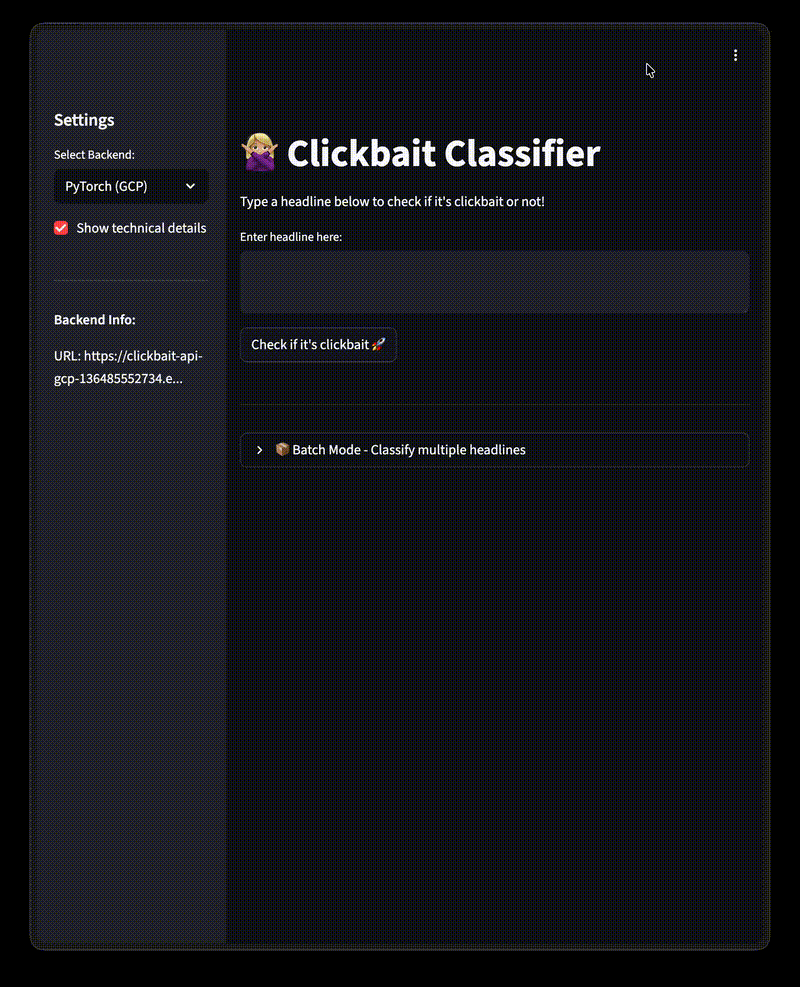

# Clickbait Classifier

A machine learning API that detects clickbait headlines using a fine-tuned DistilBERT model.

<p align="center">
  
</p>

## 🚀 Try It Live

**Frontend:** https://clickbait-frontend-136485552734.europe-west1.run.app

**API Documentation:** https://clickbait-api-gcp-136485552734.europe-west1.run.app/docs

> ⚠️ **Note:** Cloud Run containers scale to zero when idle. The first request after inactivity may take 10-30 seconds to cold start. If it times out, try again!

## API Endpoints

| Endpoint          | Method | Description                 |
| ----------------- | ------ | --------------------------- |
| `/classify`       | POST   | Classify single headline    |
| `/classify/batch` | POST   | Classify multiple headlines |

### Example

```bash
curl -X POST https://clickbait-api-gcp-136485552734.europe-west1.run.app/classify \
  -H "Content-Type: application/json" \
  -d '{"text": "You Won'\''t BELIEVE What This Celebrity Did Next!"}'
```

Response:

```json
{
  "text": "You Won't BELIEVE What This Celebrity Did Next!",
  "is_clickbait": true,
  "confidence": 0.998
}
```

## 🏃 Run Locally

```bash
# Clone and setup
git clone https://github.com/kajahovinbole/Machine-Learning-Operations.git
cd Machine-Learning-Operations
uv sync

# Run frontend
uv run streamlit run src/clickbait_classifier/frontend.py

# Or run API
uv run invoke dev-api
```

## 📊 Model Performance

- **Accuracy:** 98.9%
- **Model:** Fine-tuned DistilBERT
- **Training data:** ~32,000 labeled headlines

## 🛠️ Tech Stack

- **ML Framework:** PyTorch + HuggingFace Transformers
- **API:** FastAPI
- **Frontend:** Streamlit
- **Deployment:** Google Cloud Run
- **Experiment Tracking:** Weights & Biases

## 📚 Documentation

- [Project Description](docs/PROJECT.md) - Goals, data, and model details
- [Development & Deployment](docs/DEPLOYMENT.md) - Setup, training, and cloud deployment

## 👥 Team

- Julia Melina Jones Borgund
- Kaja Hovinbøle
- Poul Guo Skov
- Yannick Brot Christensen
